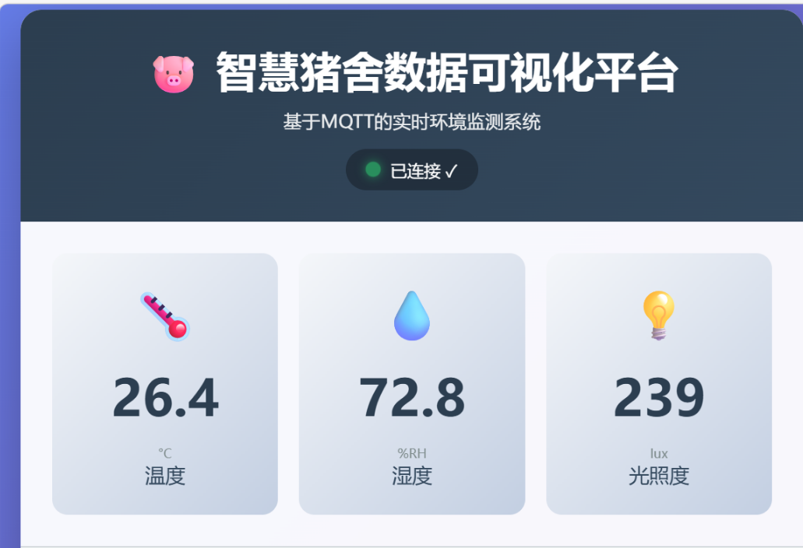
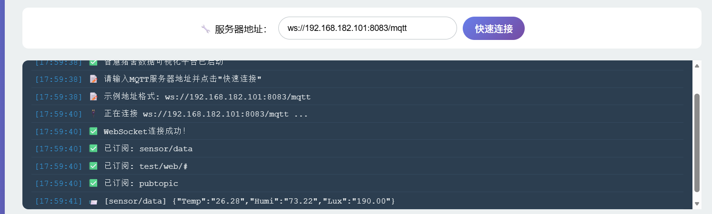
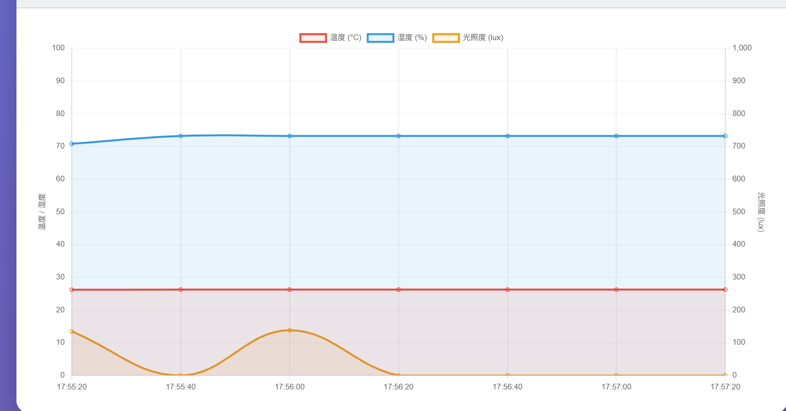
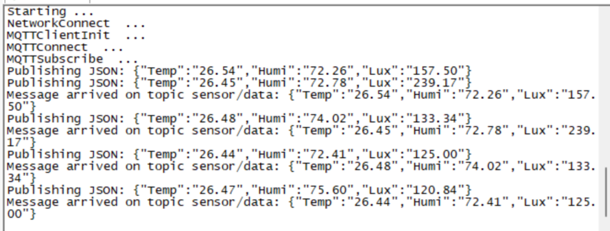
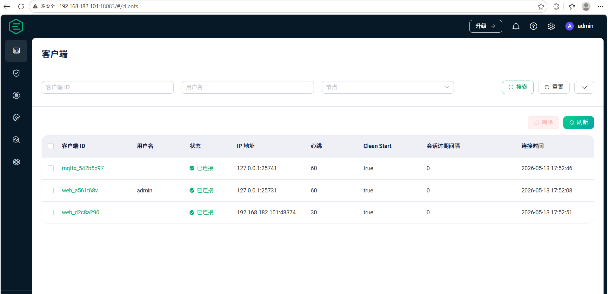

#  🐷 智慧猪舍环境监测系统

基于小熊派(HarmonyOS) + EMQX + MQTT + Web的智慧猪舍环境监控平台，实时监测温湿度、光照度数据。

##  项目简介 

本项目实现了一个完整的物联网环境监测系统，实时采集和展示猪舍环境数据。

##  系统架构 

小熊派(传感器) --MQTT--> EMQX(Broker) --WebSocket--> Web页面(可视化)

##  功能特性 

\- 🌡️ 实时监测温度、湿度、光照度

\- 📊 图表展示历史数据趋势

\- 🔌 基于MQTT协议的可靠数据传输

\- 🎨 响应式Web界面，支持移动端

##  硬件要求 

| 组件 | 型号 |

| 开发板 | 小熊派 BearPi |

| 传感器 | E53\_IA1 |

| 网络 | WiFi 2.4GHz |

##  🚀 快速开始

~~~python
#1.安装EMQX
docker run -d --name emqx -p 1883:1883 -p 8083:8083 -p 18083:18083 emqx/emqx:latest

#2. 配置小熊派
修改 bearpi_code/mqtt_sensor.c 中的WiFi和服务器地址，编译烧录。


#3. 启动Web页面
直接双击 web/index.html 或在浏览器中打开。


#4. 连接查看数据
输入WebSocket地址：ws://你的EMQX_IP:8083/mqtt，点击连接即可。
~~~

##  小熊派端代码说明

###  文件说明

- `mqtt_sensor.c` - 主程序，包含传感器采集和MQTT通信

###  配置修改

`WiFi配置`

```python
WifiConnect("你的WiFi名称", "WiFi密码")
```

`EMQX服务器配置`

```python
NetworkConnect(&network, "EMQX服务器IP", 1883);
```

>  📊 数据格式（json）
>
> {
>     "Temp": "26.50",
>     "Humi": "65.30",
>     "Lux": "318.50"
> }

## 实验结果

### 网页显示效果







### 串口输出


### EMQX客户端连接


## 项目文件说明
- `D5_iot_mqtt/` - 小熊派源代码
- `screenshots/` - 实验结果截图

## 快速使用
1. 烧录小熊派代码
2. 启动EMQX
3. 打开 `web/index.html`
4. 连接查看数据

## 技术栈
- 硬件：小熊派 + E53_IA1
- 协议：MQTT
- 后端：EMQX
- 前端：HTML + JavaScript + Chart.js

}